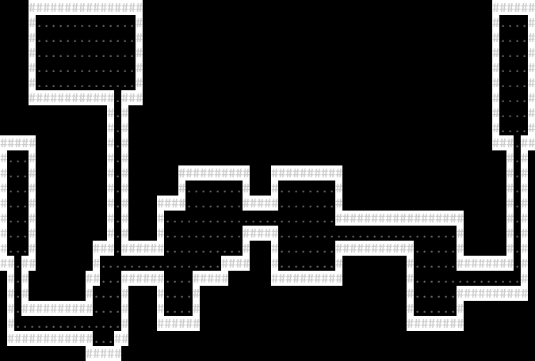

# DotNetDungeon V.0.1.1

<p align="center">
  
</p>

Hello Brave Adventurer! Welcome to **DotNetDungeon V.0.1.1**, an ASCII roguelike dungeon crawler inspired by classics like NetHack!

## About the Project

DotNetDungeon is an exciting roguelike adventure built with .NET where you'll navigate through procedurally generated dungeons, face deadly creatures, and search for the elusive exit while struggling to survive. Your quest is simple yet perilous: find your way out of the dungeon or perish in the attempt!

### Current Status

The project is now in version V.0.1.1! We have successfully implemented colorful dungeon visualization, bringing life to the ASCII environment. The dungeon now features colored walls, floors, and empty spaces that enhance the visual experience.

### Features
- Procedural dungeon generation (✓ Completed in V.0.1.0)
- Colorful dungeon elements (✓ Completed in V.0.1.1)
- Character creation and progression (Planning phase)
- Non-playable enemies and monsters (Planning phase)
- Dungeon items and interactive elements (Planning phase)
- Survival mechanics and crafting system (Planning phase)
- Multiplayer collaborative gameplay (Long-term vision)

Stay tuned as we continue to expand this vibrant ASCII adventure!

<p align="center">
  
</p>

## Requirements
- .NET SDK 9.0 or higher

## How to Run the Game

There are two ways to run the game:

### Method 1: From the game project folder
```bash
# Navigate to the game project folder
cd DotNetDungeon-Game

# Run the project
dotnet run
```

### Method 2: From the root folder
```bash
# Run the project specifying the path
dotnet run --project DotNetDungeon-Game/DotNetDungeon-Game.csproj
```

> **Note:** The second method works on any operating system, although on Windows you might need to use backslash (`\`) instead of forward slash (`/`) depending on the terminal you're using.